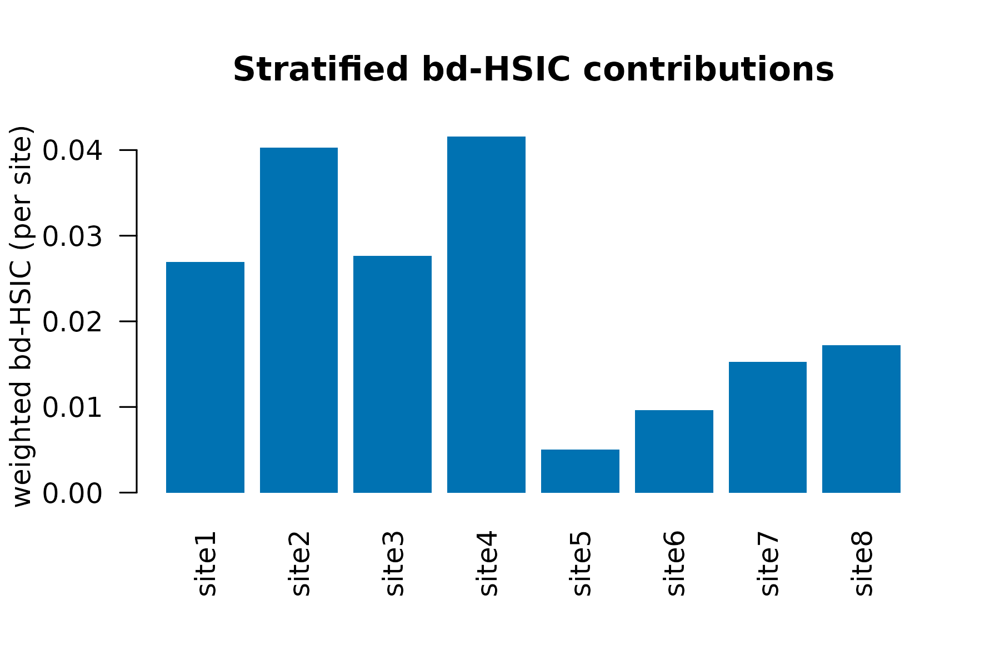

# Hierarchical bd-HSIC for Multi-Site Designs

## Why a hierarchical version of bd-HSIC?

Agricultural trials almost always carry design clustering: paddocks
within sites, sites within regions, plots within farms, seasons within
years. Treat such data as i.i.d. and the permutation null breaks: by
shuffling treatment labels across clusters, the null distribution
absorbs cluster-level variation as if it were causal signal, inflating
Type I error.

The original bd-HSIC test (Hu, Sejdinovic & Evans, 2024) handles this by
clustering on propensity-score similarity. That works when the design
has no natural hierarchy. When the *design itself* tells you which
observations should be exchangeable – *site*, *paddock*, *season* – you
should use the design clusters directly.

[`bd_hsic_test()`](https://max578.github.io/kernR/reference/bd_hsic_test.md)
accepts an optional `cluster_id` argument exactly for this case.
Supplying it activates **within-cluster permutation**: indices of `y`
are reshuffled only within each cluster, preserving cluster-level
effects in the null.

## A multi-site stub

``` r

library(kernR)

# 8 sites x 30 plots/site = 240 observations.
# Each site has its own random effect on yield.
n_sites <- 8L
n_per   <- 30L
n       <- n_sites * n_per
site    <- factor(paste0("site", rep(seq_len(n_sites), each = n_per)))
site_id <- as.integer(site)

set.seed(101L)
site_effect <- stats::rnorm(n_sites, sd = 1.0)[site_id]

# Confounders: rainfall, soil_n
z <- cbind(
  rainfall = stats::rnorm(n),
  soil_n   = stats::rnorm(n)
)
# Management treatment (e.g. residue retention intensity)
x <- 0.4 * z[, "rainfall"] + 0.3 * site_effect + stats::rnorm(n)
# Yield: causal effect of management + confounders + site random effect
y <- 0.6 * x + 0.5 * z[, "soil_n"] + site_effect + stats::rnorm(n, sd = 0.5)
```

## Naive vs hierarchical permutation

The same data, two permutation schemes:

``` r

fit_naive <- bd_hsic_test(
  x, y, z,
  permutation    = "naive",
  n_permutations = 199L,
  seed           = 1L
)

fit_hier <- bd_hsic_test(
  x, y, z,
  cluster_id     = site,        # activates within_cluster by default
  n_permutations = 199L,
  seed           = 1L
)

data.frame(
  scheme  = c(fit_naive$permutation_scheme, fit_hier$permutation_scheme),
  stat    = c(fit_naive$statistic,   fit_hier$statistic),
  p_value = c(fit_naive$p_value,     fit_hier$p_value),
  ess     = c(fit_naive$ess,         fit_hier$ess),
  row.names = NULL
)
#>           scheme       stat p_value      ess
#> 1          naive 0.02198144   0.005 119.9986
#> 2 within_cluster 0.02198144   0.005 119.9986
```

In the presence of a true causal effect, both schemes typically reject;
under the null, the naive scheme is more prone to false positives.

## Stratified per-cluster contributions

When `cluster_id` is supplied, the result carries a per-cluster bd-HSIC
breakdown:

``` r

fit_hier$per_cluster_statistic
#>       site1       site2       site3       site4       site5       site6 
#> 0.026940010 0.040274145 0.027650642 0.041580679 0.005001357 0.009660079 
#>       site7       site8 
#> 0.015288101 0.017232744
```

Plot the per-cluster contributions to look for a single-site dominant
signal vs. a uniformly distributed effect:

``` r

graphics::barplot(
  fit_hier$per_cluster_statistic,
  las  = 2L,
  col  = "#0072B2",
  border = NA,
  ylab = "weighted bd-HSIC (per site)",
  main = "Stratified bd-HSIC contributions"
)
```



A site whose stratified statistic dwarfs the others is a candidate for
follow-up investigation – either real site-specific effect modification
or a data-quality issue.

## Type-I behaviour under a true null with cluster effects

To illustrate why the hierarchical scheme matters, here is the null
case: cluster effects exist, but `x` has no causal effect on `y`.

``` r

set.seed(202L)
n_sites <- 8L; n_per <- 30L; n <- n_sites * n_per
site <- factor(paste0("s", rep(seq_len(n_sites), each = n_per)))
site_id <- as.integer(site)
site_effect <- stats::rnorm(n_sites, sd = 1.0)[site_id]
z <- cbind(stats::rnorm(n), stats::rnorm(n))
x <- 0.4 * z[, 1L] + 0.3 * site_effect + stats::rnorm(n)
y <- 0.5 * z[, 2L] + site_effect + stats::rnorm(n, sd = 0.5)  # no x

fit_null <- bd_hsic_test(
  x, y, z,
  cluster_id     = site,
  n_permutations = 199L,
  seed           = 202L
)
fit_null$p_value
#> [1] 0.925
```

Under the null, the hierarchical scheme should not reject (`p > 0.05`);
the naive scheme on the same data is more likely to.

## Choosing the scheme

| Scenario | Scheme |
|----|----|
| Truly i.i.d. observations, no design clustering | `permutation = "auto"`, no `cluster_id` |
| Multi-site / multi-season ag design | `cluster_id = site` (default within-cluster) |
| Within-cluster independence is plausible *and* you want maximum power | `permutation = "naive"` (rare in practice) |

## Notes on practice

- **Cluster size.** Within-cluster permutation needs `>= 2` test
  observations per cluster (test split = `1 - split_ratio` of `n`).
  Smaller clusters are reported as `NA` in `per_cluster_statistic` and
  contribute the identity permutation.
- **Many small clusters.** When clusters are small (e.g. paddocks of 3-5
  plots), within-cluster permutation has limited power; consider pooling
  at a coarser level (site instead of paddock).
- **Imbalanced design.** Per-cluster statistics are reported on the raw
  scale, not weighted by cluster size; combine externally if you need a
  size-weighted summary.

## Reference

- Hu, R., Sejdinovic, D., & Evans, R. J. (2024). *A kernel test for
  causal association via noise contrastive backdoor adjustment.* Journal
  of Machine Learning Research, 25(160), 1-56.
