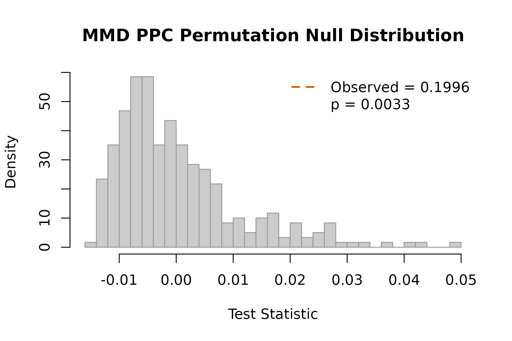

# Posterior-Predictive Check with MMD

## The question

After running an iterative ensemble smoother (PESTO, PEST++, EnKF, …)
against historical observations, *does the calibrated model produce a
posterior-predictive distribution that is consistent with a held-out
year or paddock?*

The standard answer in PEST++-style workflows is RMSE on the
posterior-predictive mean. That can only catch differences in central
tendency. A distribution can match in mean but fail dramatically in
variance, skewness, or tail probability – precisely the failures that
matter for climate-risk decisions.

[`mmd_ppc()`](https://max578.github.io/kernR/reference/mmd_ppc.md)
answers the distributional version of the question: are the
posterior-predictive draws and the held-out observations samples from
the same distribution? It is a model-free, kernel two-sample test (MMD)
plus a Bayesian-flavoured *surprise* diagnostic.

## The stub ensemble

Until PESTO ships its native manifest emitter, we construct a
`pesto_ensemble` object directly. This is the kernR-side schema for the
cross-package contract.

``` r

library(kernR)

# True data-generating distribution: bivariate (yield, biomass)
n_obs <- 30L

# Held-out observations from the "real" world
truth_mean <- c(yield = 4.5, biomass = 12.0)
truth_sd   <- c(yield = 0.6, biomass = 1.5)
observed <- cbind(
  yield   = stats::rnorm(n_obs, truth_mean["yield"],   truth_sd["yield"]),
  biomass = stats::rnorm(n_obs, truth_mean["biomass"], truth_sd["biomass"])
)
```

## Case A: well-calibrated posterior

``` r

M <- 300L
post_good <- cbind(
  yield   = stats::rnorm(M, truth_mean["yield"],   truth_sd["yield"]),
  biomass = stats::rnorm(M, truth_mean["biomass"], truth_sd["biomass"])
)
ens_good <- pesto_ensemble(
  posterior = post_good,
  observed  = observed,
  metadata  = list(holdout_year = 2018L, ies_iters = 6L)
)
ens_good
#> 
#>   PESTO ensemble manifest
#> 
#> Posterior: 300 draws x 2 dims
#> Observed:  30 obs x 2 dims
#> Metadata:  holdout_year, ies_iters

fit_good <- mmd_ppc(ens_good, n_permutations = 299L, seed = 1L)
fit_good
#> 
#>    MMD PPC Test
#> 
#> Statistic: 0.00661733 
#> P-value:   0.1900 
#> N:         330 
#> Perms:     299 
#> Kernel X:  rbf (bw = 1.736)
#> 
#> PPC verdict
#>   Posterior:  300 draws
#>   Observed:   30 obs
#>   Surprise:   2.396 bits
#>   Verdict:    consistent with observations
#>   Metadata:   holdout_year, ies_iters
```

A small `surprise_bits` (well below `log2(B + 1)`) and a verdict of
*consistent with observations* mean the calibrated model has not been
falsified by the held-out data at the distributional level.

## Case B: miscalibrated posterior (variance too narrow)

A common ensemble-smoother pathology is over-confidence: posterior draws
clustered too tightly around the posterior mean.

``` r

post_narrow <- cbind(
  yield   = stats::rnorm(M, truth_mean["yield"],   truth_sd["yield"] / 3),
  biomass = stats::rnorm(M, truth_mean["biomass"], truth_sd["biomass"] / 3)
)
ens_narrow <- pesto_ensemble(post_narrow, observed,
                             metadata = list(scenario = "narrow"))
fit_narrow <- mmd_ppc(ens_narrow, n_permutations = 299L, seed = 1L)
fit_narrow
#> 
#>    MMD PPC Test
#> 
#> Statistic: 0.199572 
#> P-value:   0.0033 
#> N:         330 
#> Perms:     299 
#> Kernel X:  rbf (bw = 0.6027)
#> 
#> PPC verdict
#>   Posterior:  300 draws
#>   Observed:   30 obs
#>   Surprise:   8.229 bits
#>   Verdict:    REJECT (posterior inconsistent with observations)
#>   Metadata:   scenario
```

The verdict here should be REJECT, with surprise well above the
threshold of ~4.32 bits (the surprise corresponding to `p = 0.05`).

## Case C: miscalibrated posterior (mean-shifted)

``` r

post_shifted <- cbind(
  yield   = stats::rnorm(M, truth_mean["yield"]   + 0.8, truth_sd["yield"]),
  biomass = stats::rnorm(M, truth_mean["biomass"] - 1.2, truth_sd["biomass"])
)
ens_shifted <- pesto_ensemble(post_shifted, observed)
fit_shifted <- mmd_ppc(ens_shifted, n_permutations = 299L, seed = 1L)
fit_shifted
#> 
#>    MMD PPC Test
#> 
#> Statistic: 0.245265 
#> P-value:   0.0033 
#> N:         330 
#> Perms:     299 
#> Kernel X:  rbf (bw = 1.692)
#> 
#> PPC verdict
#>   Posterior:  300 draws
#>   Observed:   30 obs
#>   Surprise:   8.229 bits
#>   Verdict:    REJECT (posterior inconsistent with observations)
```

## Comparing surprise across scenarios

``` r

res <- list(
  calibrated   = fit_good,
  narrow       = fit_narrow,
  mean_shifted = fit_shifted
)
data.frame(
  scenario      = names(res),
  statistic     = vapply(res, function(z) z$statistic, numeric(1)),
  p_value       = vapply(res, function(z) z$p_value, numeric(1)),
  surprise_bits = vapply(res, function(z) z$surprise_bits, numeric(1)),
  reject        = vapply(res, function(z) z$reject, logical(1)),
  row.names     = NULL
)
#>       scenario   statistic     p_value surprise_bits reject
#> 1   calibrated 0.006617331 0.190000000      2.395929  FALSE
#> 2       narrow 0.199572124 0.003333333      8.228819   TRUE
#> 3 mean_shifted 0.245265264 0.003333333      8.228819   TRUE
```

## Visual diagnostic

The inherited [`plot()`](https://rdrr.io/r/graphics/plot.default.html)
method shows the permutation null distribution with the observed MMD
statistic marked:

``` r

plot(fit_narrow)
```



## Notes on practice

- **Ensemble size.** Distributional power is set by both the ensemble
  size `M` and the held-out sample size `n_obs`. For ag-scale problems
  `M` in the low hundreds is usually sufficient; `n_obs >= 20` is a
  practical floor.
- **Permutations.** At `B = 299` the minimum achievable p-value is
  `1 / 300 ~ 0.0033`; correspondingly the maximum surprise is
  `log2(300) ~ 8.23` bits. Increase `B` when working in the small-p
  regime.
- **Interpreting surprise.** Surprise is Shannon information of the
  permutation p-value: 0 bits at `p = 1`, 4.32 bits at `p = 0.05`, and
  capped at `log2(B + 1)`. It is *not* the strict Bayesian-surprise KL
  divergence; use it as an intuitive scalar verdict, not as a posterior
  probability.
- **Multi-dimensional outputs.**
  [`mmd_ppc()`](https://max578.github.io/kernR/reference/mmd_ppc.md)
  handles `d > 1` natively via the kernel choice; the default RBF with
  median-heuristic bandwidth is computed over the pooled posterior +
  observed sample.

## Cross-package handoff

PESTO 0.3.0 ships a native ensemble emitter — the
[`PESTO::pesto_ensemble_manifest`](https://rdrr.io/pkg/PESTO/man/pesto_ensemble_manifest.html)
S7 class — which
[`mmd_ppc()`](https://max578.github.io/kernR/reference/mmd_ppc.md)
consumes via a dedicated method. The legacy lightweight `pesto_ensemble`
S3 constructor is unchanged and remains supported.

``` r

library(PESTO)

# Build a tiny synthetic manifest (in real workflows: come from
# pesto_ies_callback() + as_manifest()).
nreal <- 80L; nobs <- 3L
post   <- matrix(rnorm(nreal * nobs), nreal, nobs)
colnames(post) <- paste0("o", seq_len(nobs))
m <- pesto_ensemble_manifest(
  run_id          = "vignette_demo",
  params          = data.frame(real_name = paste0("r", seq_len(nreal)),
                                p1 = rnorm(nreal),
                                p2 = rnorm(nreal),
                                check.names = FALSE),
  outputs         = data.frame(real_name = paste0("r", seq_len(nreal)),
                                post, check.names = FALSE),
  weights         = setNames(rep(1, nobs), colnames(post)),
  obs_target      = setNames(rnorm(nobs),  colnames(post)),
  data_hash       = "sha256:vignette_demo",
  pesto_version   = as.character(packageVersion("PESTO")),
  timestamp       = Sys.time(),
  method          = "ies_callback",
  noptmax         = 1L,
  lambda_schedule = 1
)

# Out-of-sample PPC: supply held-out observations explicitly. The
# manifest's `obs_target` slot is a single nobs-dim point (the data
# the posterior was fit to) and is not a valid two-sample comparator
# on its own.
held_out <- matrix(rnorm(20L * nobs), 20L, nobs)
colnames(held_out) <- colnames(post)
mmd_ppc(m, observed = held_out, n_permutations = 199L, seed = 1L)
#> 
#>    MMD PPC Test
#> 
#> Statistic: -0.00916666 
#> P-value:   0.7250 
#> N:         100 
#> Perms:     199 
#> Kernel X:  rbf (bw =  2.25)
#> 
#> PPC verdict
#>   Posterior:  80 draws
#>   Observed:   20 obs
#>   Surprise:   0.464 bits
#>   Verdict:    consistent with observations
#>   Metadata:   run_id, pesto_version, method, outputs_used
```

The `outputs =` argument focuses the check on specific observation
columns (parallel to
[`dr_date_scenario()`](https://max578.github.io/kernR/reference/dr_date_scenario.md)’s
convention).

## References

- Gelman, A., Meng, X.-L., & Stern, H. (1996). Posterior predictive
  assessment of model fitness via realized discrepancies. *Statistica
  Sinica*, 6(4), 733-760.
- Gretton, A., Borgwardt, K. M., Rasch, M. J., Schölkopf, B., &
  Smola, A. (2012). A kernel two-sample test. *JMLR*, 13, 723-773.
