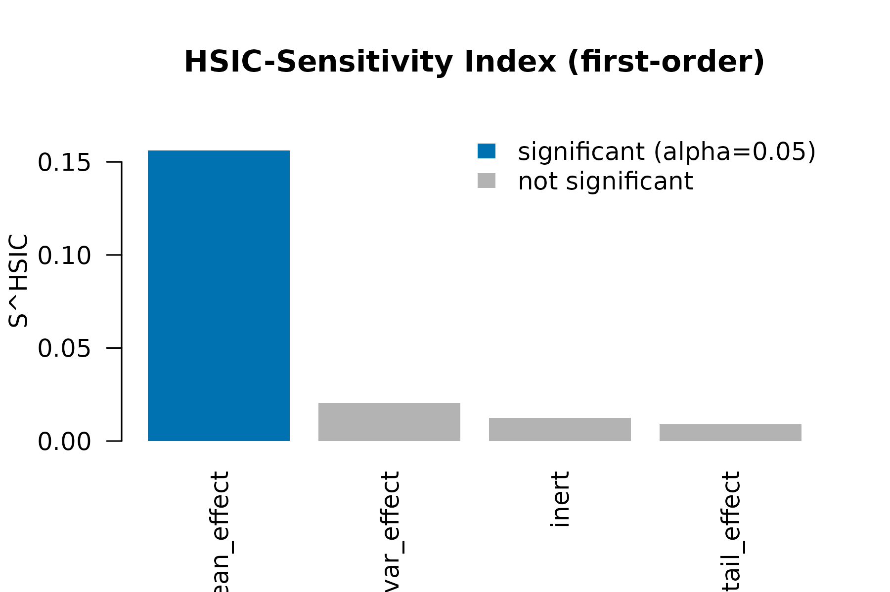
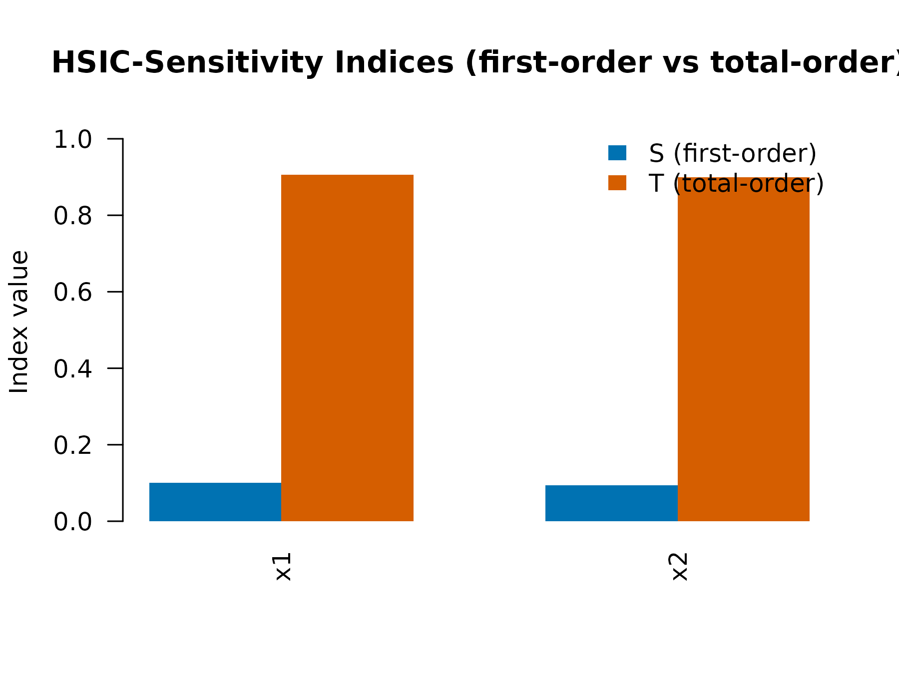

# HSIC-Based Distributional Sensitivity

## What HSIC-Sensitivity catches that Sobol misses

Variance-based Sobol indices are the workhorse of global sensitivity
analysis: they decompose the output variance into contributions from
each input. They have one structural blind spot – *distributional*
effects that leave variance unchanged. A parameter that flips the output
skewness, fattens its tails, or shifts a quantile without moving the
variance is invisible to Sobol.

The HSIC-Sensitivity Index (Da Veiga, 2015) replaces the variance with a
kernel-based dependence measure (the Hilbert-Schmidt Independence
Criterion). The normalised first-order index is

``` math
S_j^{\mathrm{HSIC}}
  = \frac{\mathrm{HSIC}(X_j, Y)}
         {\sqrt{\mathrm{HSIC}(X_j, X_j) \cdot \mathrm{HSIC}(Y, Y)}}
  \in [0, 1].
```

It is bounded like a Sobol index, comparable in magnitude across
parameters, and detects mean-preserving distributional effects.

## A sensitivity scan on a stubbed APSIM-like simulator

``` r

library(kernR)

stub_apsim <- function(theta) {
  # theta: n x 4 matrix
  # `mean_effect` shifts the mean (Sobol catches this)
  # `var_effect`  shifts the variance only -- mean-preserving
  # `tail_effect` injects a heavy-tailed component (visible to HSIC)
  # `inert`       has no effect
  n <- nrow(theta)
  yield <- 1.5 * theta[, "mean_effect"] +
           stats::rnorm(n, sd = exp(theta[, "var_effect"])) +
           theta[, "tail_effect"] *
             stats::rt(n, df = 3) * 0.4 +
           stats::rnorm(n, sd = 0.05)
  matrix(yield, ncol = 1L, dimnames = list(NULL, "yield"))
}

bounds <- rbind(
  mean_effect = c(0.0, 1.0),
  var_effect  = c(-0.5, 0.5),
  tail_effect = c(0.0, 1.0),
  inert       = c(0.0, 1.0)
)
design <- lhs_design(n = 200L, bounds = bounds, seed = 11L)
y      <- stub_apsim(design)
```

## The scan

``` r

fit <- hsic_sensitivity(
  theta          = design,
  y              = y,
  n_permutations = 199L,
  seed           = 11L
)
fit
#> 
#>   HSIC-Sensitivity Indices
#> 
#> Parameters:   4 
#> Outputs:      1 
#> N:            200 
#> Permutations: 199 
#> P-adjust:     BH 
#> Total-order: no
#> 
#> Per-parameter ranking (descending S, max across outputs):
#>   S = first-order index
#> 
#>    parameter S_first_max min_p_first
#>  mean_effect       0.156      0.0200
#>   var_effect       0.020      0.1400
#>        inert       0.013      0.4000
#>  tail_effect       0.009      0.5250
```

The print method ranks parameters by their first-order HSIC-Sensitivity
Index. Expectations on this design:

- `mean_effect` – large index, small p-value (Sobol would also catch
  this).
- `var_effect` – non-negligible index despite preserving the conditional
  mean (Sobol misses this).
- `tail_effect` – detectable distributional contribution.
- `inert` – index near zero, p-value not significant.

## Visual

``` r

plot(fit)
```



Bars colour-coded by significance at the default `alpha = 0.05` after
Benjamini-Hochberg adjustment.

## Side-by-side with `sensitivity::sobol`

If you have the `sensitivity` package installed, you can compare HSIC
indices to Sobol’s first-order indices on the same design:

    library(sensitivity)
    sobol_fit <- sensitivity::sobolEff(
      model = function(X) stub_apsim(as.matrix(X))[, 1L],
      X1    = as.data.frame(design[1:100, ]),
      X2    = as.data.frame(design[101:200, ]),
      nboot = 200
    )
    # Compare sobol_fit$S to fit$index

The headline observation: Sobol will rank `mean_effect` first and likely
flag `tail_effect` and `var_effect` as small/negligible. HSIC captures
the latter two as genuine signal – the verdict you want when the
decision-relevant question is *whether the parameter changes the
distribution*, not just the variance.

## Tabular form

``` r

df <- as.data.frame(fit)
df[order(-df$index), ]
#>     parameter output       index    statistic p_value p_value_adjusted
#> 1 mean_effect  yield 0.156179387 0.0135556487   0.005            0.020
#> 2  var_effect  yield 0.020423111 0.0017713847   0.070            0.140
#> 4       inert  yield 0.012529016 0.0010870367   0.300            0.400
#> 3 tail_effect  yield 0.008953081 0.0007768353   0.525            0.525
```

## Total-order indices

The **first-order** index `S_j` measures the direct contribution of
`X_j` to `Y`. It misses contributions of `X_j` *through interactions*
with other parameters. The **total-order** index, in Da Veiga’s
complement formulation,

``` math
T_j^{\mathrm{HSIC}}
  = 1 - \frac{\mathrm{HSIC}(X_{\sim j}, Y)}
              {\sqrt{\mathrm{HSIC}(X_{\sim j}, X_{\sim j}) \cdot
                     \mathrm{HSIC}(Y, Y)}}
```

captures the total – direct plus all-order interactions – contribution
of `X_j`. By construction:

- Purely additive model `Y = sum_j f_j(X_j)`: `T_j = S_j`.
- Pure interaction `Y = X_1 X_2`: `S_j` may be near zero (marginal
  signal averages out) but `T_j` is strong.

The difference `T_j - S_j` quantifies the interactive component.

### A pure-interaction example

``` r

set.seed(42L)
n <- 400L
theta_int <- matrix(stats::runif(n * 2L, min = -1, max = 1), n, 2L,
                    dimnames = list(NULL, c("x1", "x2")))
y_int <- theta_int[, "x1"] * theta_int[, "x2"] +
         stats::rnorm(n, sd = 0.05)

fit_int <- hsic_sensitivity(
  theta          = theta_int,
  y              = y_int,
  total_order    = TRUE,
  p_value        = FALSE,    # total-order p-values not computed (see Notes)
  n_permutations = 199L,
  seed           = 42L
)
fit_int
#> 
#>   HSIC-Sensitivity Indices
#> 
#> Parameters:   2 
#> Outputs:      1 
#> N:            400 
#> Permutations: skipped (p_value = FALSE)
#> Total-order: yes
#> 
#> Per-parameter ranking (descending S, max across outputs):
#>   S = first-order index   T = total-order index   interaction = T - S
#> 
#>  parameter S_first_max T_total_max interaction min_p_first
#>         x1       0.100       0.906       0.806          --
#>         x2       0.094       0.900       0.806          --
```

Both `x1` and `x2` should have small first-order indices (the marginal
expectation of `X1 X2` is zero) but large total-order indices. The
`interaction = T - S` column makes the gap explicit.

### Side-by-side plot

``` r

plot(fit_int, which = "both")
```



### A near-additive example for contrast

``` r

theta_add <- matrix(stats::runif(n * 2L), n, 2L,
                    dimnames = list(NULL, c("x1", "x2")))
y_add <- 2 * theta_add[, "x1"] + theta_add[, "x2"] +
         stats::rnorm(n, sd = 0.05)

fit_add <- hsic_sensitivity(theta_add, y_add, total_order = TRUE,
                            p_value = FALSE, seed = 1L)
fit_add
#> 
#>   HSIC-Sensitivity Indices
#> 
#> Parameters:   2 
#> Outputs:      1 
#> N:            400 
#> Permutations: skipped (p_value = FALSE)
#> Total-order: yes
#> 
#> Per-parameter ranking (descending S, max across outputs):
#>   S = first-order index   T = total-order index   interaction = T - S
#> 
#>  parameter S_first_max T_total_max interaction min_p_first
#>         x1       0.721       0.884       0.163          --
#>         x2       0.116       0.279       0.163          --
```

On this additive model `T_j - S_j` should be close to zero for both
parameters.

### Pair-bootstrap CI for total-order indices

`total_order_ci = TRUE` (since 0.0.0.9013) activates a pair-bootstrap
percentile CI on each total-order index `T_j`:

``` r

fit_pf <- hsic_sensitivity(
  theta_add, y_add,
  total_order         = TRUE,
  total_order_ci      = TRUE,
  n_permutations      = 199L,
  n_bootstrap         = 100L,
  ci_level            = 0.95,
  seed                = 7L
)
fit_pf
#> 
#>   HSIC-Sensitivity Indices
#> 
#> Parameters:   2 
#> Outputs:      1 
#> N:            400 
#> Permutations: 199 
#> P-adjust:     BH 
#> Total-order: yes
#> 
#> Per-parameter ranking (descending S, max across outputs):
#>   S = first-order index   T = total-order index   interaction = T - S
#>   T_CI = pair-bootstrap 95% percentile CI on T (B = 100 resamples). NOT a significance test for T = 0; see ?hsic_sensitivity Details.
#> 
#>  parameter S_first_max T_total_max interaction min_p_first           T_CI
#>         x1       0.721       0.884       0.163      0.0050 [0.836, 0.920]
#>         x2       0.116       0.279       0.163      0.0050 [0.242, 0.322]
as.data.frame(fit_pf)[, c("parameter", "output",
                          "index_total_order",
                          "ci_total_order_lower",
                          "ci_total_order_upper")]
#>   parameter output index_total_order ci_total_order_lower ci_total_order_upper
#> 1        x1     y1         0.8838120            0.8362184            0.9201480
#> 2        x2     y1         0.2788908            0.2422700            0.3218026
```

The CI is uncertainty quantification on the *index magnitude*, not a
hypothesis test. An earlier (0.0.0.9012) `total_order_p_value` field
claimed to test `H_0: T_j = 0` — that was found in critical review on
2026-05-16 to be mis-calibrated under pure-noise `Y` (all parameters
were assigned `p ≈ 1/(1 + B)` because the bootstrap samples the
empirical joint, not a null-of-no-effect) and was removed in 0.0.0.9013.
A properly null-calibrated total-order significance test remains future
work. Cost scales as `n_bootstrap × p × q` kernel re-evaluations on
resampled designs; default `n_bootstrap = 200` is a workable starting
point for `p, q ≤ 10`, `n ≤ 1000`.

## Notes on total-order indices

- **Cost.** Total-order construction is `O(p n^2)` for kernel matrices
  on each `X_{~j}` plus `O(p q n^2)` for HSIC, similar in scale to
  first-order. For ag-scale designs (`n` in the hundreds-low thousands)
  both are practical. Pick-Freeze bootstrap multiplies this by
  `n_bootstrap` (default 200) — budget accordingly.
- **Nystrom acceleration for total-order** is intentionally not exposed
  in this version. The naive way to fold
  [`nystrom_factor()`](https://max578.github.io/kernR/reference/nystrom_factor.md)
  into `T_j` computation (materialising `F F^T` into a full `n x n`
  kernel) is slower than the exact path at typical kernR scales, because
  materialisation costs `O(n^2 m)`. A proper factor-only HSIC primitive
  (Nystrom-on-Nystrom) is the unblocking next step and is on the
  future-work list.

## Notes on practice

- **Design size.** As with B1 identifiability, `n >= 10p` is a
  reasonable starting point.
- **Permutations.** When the goal is ranking only, set `p_value = FALSE`
  to skip the permutation null entirely – the per-column kernel cache is
  reused, so the index calculation is cheap. Use `p_value = TRUE`
  (default) when you also want a significance verdict on first-order
  indices.

## Notes on practice

- **Design size.** As with B1 identifiability, `n >= 10p` is a
  reasonable starting point.
- **Permutations.** When the goal is ranking only, set `p_value = FALSE`
  to skip the permutation null entirely – the per-column kernel cache is
  reused, so the index calculation is cheap. Use `p_value = TRUE`
  (default) when you also want a significance verdict.
- **Comparing to Sobol.** HSIC-SI is not numerically equal to a Sobol
  first-order index even on linear additive systems. They are *bounded
  comparable* (both in `[0, 1]`) and typically agree on ranking when
  only mean effects are present. Disagreement is the point: when HSIC
  ranks a Sobol-flat parameter highly, that parameter is shifting the
  output distribution in a non-variance way.

## References

- Da Veiga, S. (2015). Global sensitivity analysis with dependence
  measures. *Journal of Statistical Computation and Simulation*, 85(7),
  1283-1305.
- Gretton, A., Bousquet, O., Smola, A., & Schölkopf, B. (2005).
  Measuring statistical dependence with Hilbert-Schmidt norms. *ALT*,
  63-77.
